# Concepts and Roadmap: RAG-N-DOCEX

This document is a deep-dive reference for the RAG-N-DOCEX architecture. It covers every major concept with diagrams and real code examples drawn directly from the codebase, and provides a detailed, actionable roadmap for evolving the system from a functional prototype into an enterprise-ready platform.

---

## Table of Contents

1. [System Architecture Overview](#system-architecture-overview)
2. [Core Concepts](#core-concepts)
   - [1. Retrieval-Augmented Generation (RAG)](#1-retrieval-augmented-generation-rag)
   - [2. Intelligent Document Processing (IDP)](#2-intelligent-document-processing-idp)
   - [3. Vectorization and Semantic Search](#3-vectorization-and-semantic-search)
   - [4. Text-to-SQL Conversion](#4-text-to-sql-conversion)
3. [Current Implementation Details](#current-implementation-details)
   - [Index Schema](#index-schema)
   - [Chunking Strategy](#chunking-strategy)
   - [HNSW Vector Algorithm](#hnsw-vector-algorithm)
4. [Future Roadmap](#future-roadmap)
   - [Phase 1 – Optimization & Performance](#phase-1--optimization--performance)
   - [Phase 2 – Scalability & DevOps](#phase-2--scalability--devops)
   - [Phase 3 – Advanced UX & Features](#phase-3--advanced-ux--features)

---

## System Architecture Overview

The following diagram shows the complete end-to-end data flow — from a PDF sitting in Azure Blob Storage all the way to a rendered answer in the Streamlit UI.

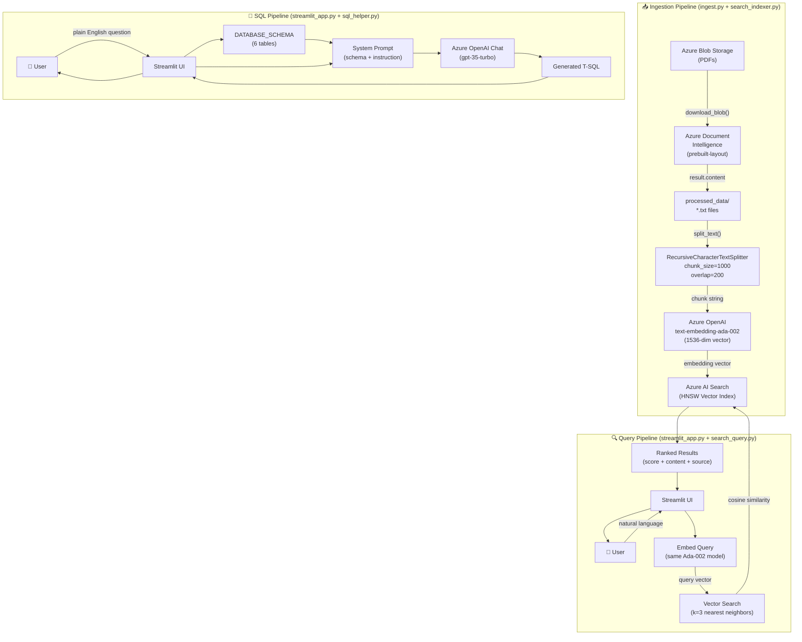

---

## Core Concepts

### 1. Retrieval-Augmented Generation (RAG)

RAG is a pattern that augments an LLM's response with dynamically retrieved private context, preventing hallucination and keeping answers grounded in real documents.

**Without RAG:** the LLM answers from parametric memory alone — it cannot know your private documents and may fabricate facts.  
**With RAG:** the LLM receives the most relevant chunks of your documents at inference time as part of its context window.

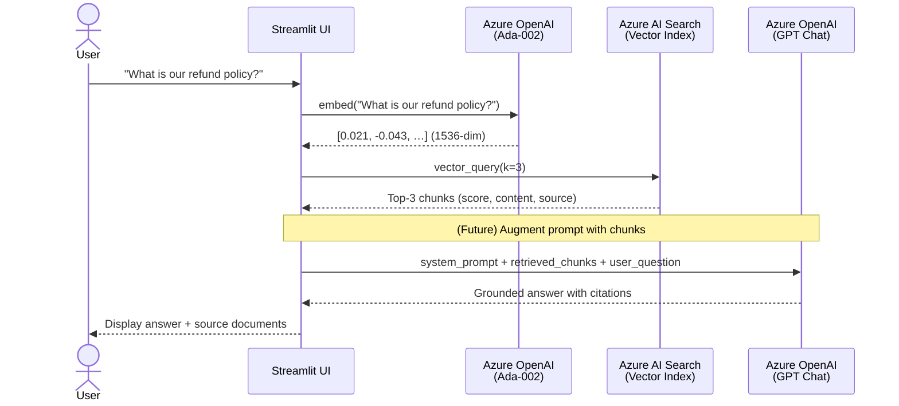

> **Current state:** The app returns the raw retrieved chunks directly. The next evolution (Phase 1) is to pass those chunks into a chat completion call so the LLM synthesises a natural-language answer with citations.

---

### 2. Intelligent Document Processing (IDP)

Raw PDFs are not plain text — they contain tables, multi-column layouts, headers, footers, and embedded images. Simply extracting bytes would destroy structure. Azure Document Intelligence's `prebuilt-layout` model preserves the logical reading order and table structure.

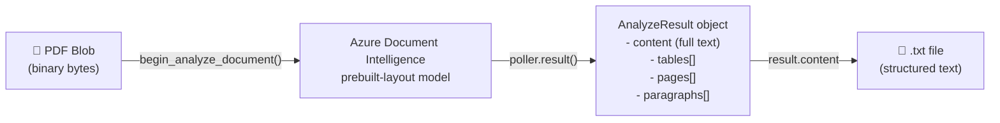

**Key code path in `ingest.py`:**

```python
# Download the PDF from Blob Storage
blob_data = blob_client.download_blob().readall()

# Submit to Document Intelligence for layout analysis
poller = di_client.begin_analyze_document(
    "prebuilt-layout",           # model: preserves tables, columns, reading order
    body=blob_data,
    content_type="application/octet-stream"
)
result = poller.result()

# The .content property returns the full structured text
extracted_text = result.content

# Persist to disk for the next pipeline stage
with open(output_path, "w", encoding="utf-8") as f:
    f.write(extracted_text)
```

> **Why `prebuilt-layout` instead of `prebuilt-read`?**  
> `prebuilt-read` only extracts plain text. `prebuilt-layout` additionally recognises table structure and spatial relationships, which is critical when your documents contain financial tables, data grids, or multi-column reports.

---

### 3. Vectorization and Semantic Search

Text chunks are converted to floating-point vectors (embeddings) that encode semantic meaning. Queries are embedded with the same model, and the nearest-neighbour search finds documents whose meaning is closest to the query — regardless of exact word overlap.

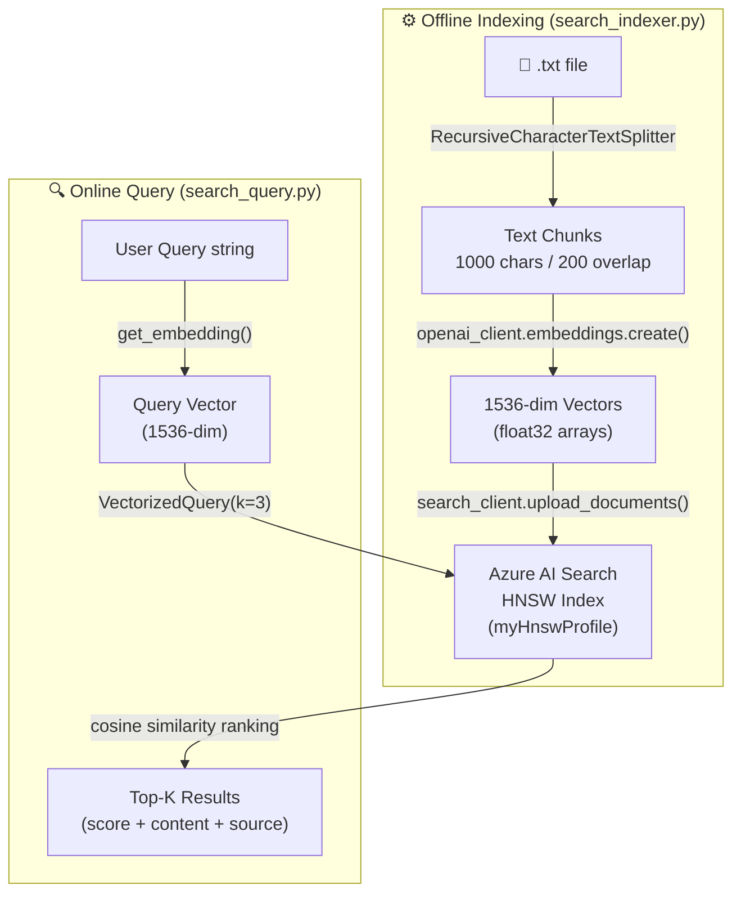

**Embedding a chunk (from `search_indexer.py`):**

```python
response = openai_client.embeddings.create(
    input=chunk,
    model=embedding_deployment   # text-embedding-ada-002
)
embedding = response.data[0].embedding  # list of 1536 floats
```

**Querying the index (from `search_query.py`):**

```python
query_vector = get_embedding(query_text)

vector_query = VectorizedQuery(
    vector=query_vector,
    k_nearest_neighbors=3,
    fields="embedding"
)

results = search_client.search(
    search_text=None,               # pure vector search, no keyword filter
    vector_queries=[vector_query],
    select=["id", "content", "source_file"]
)
```

> **Why 1536 dimensions?** `text-embedding-ada-002` produces 1536-dimensional vectors. Every chunk and every query must use the same model to ensure vectors live in the same semantic space.

---

### 4. Text-to-SQL Conversion

The SQL module translates a plain-English question into a valid T-SQL query by injecting the full database schema into the system prompt. The LLM acts as a schema-aware query planner.

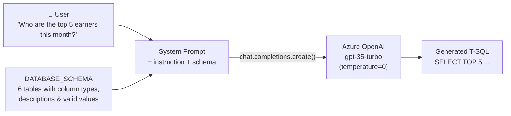

**Prompt construction in `sql_helper.py`:**

```python
system_prompt = f"""You are a SQL expert.
Given the following database schema, generate a valid SQL query to answer the user's question.
Do NOT output any markdown, backticks, or explanations. Just the raw SQL query.

Schema:
{DATABASE_SCHEMA}
"""

response = client.chat.completions.create(
    model=deployment,
    messages=[
        {"role": "system", "content": system_prompt},
        {"role": "user",   "content": user_question}
    ],
    temperature=0   # deterministic output — critical for SQL correctness
)
```

> **Why `temperature=0`?** SQL queries must be syntactically exact. A higher temperature introduces randomness that can produce invalid SQL. Setting it to `0` makes the model produce the single most likely (most deterministic) token at each step.

---

## Current Implementation Details

### Index Schema

The Azure AI Search index is defined with four fields:

| Field | Type | Role |
|---|---|---|
| `id` | `String` (key) | Unique identifier per chunk (`filename_chunkindex`) |
| `content` | `String` (searchable) | Raw text of the chunk |
| `source_file` | `String` (filterable) | Originating `.txt` filename for citations |
| `embedding` | `Collection(Single)` | 1536-dim vector for nearest-neighbour search |

### Chunking Strategy

`RecursiveCharacterTextSplitter` from LangChain splits text hierarchically — trying paragraph boundaries first, then sentence boundaries, then word boundaries — to avoid cutting in the middle of a concept.

```
chunk_size    = 1000 characters  (max tokens per chunk passed to the LLM)
chunk_overlap = 200  characters  (ensures context continuity across chunk boundaries)
```

A 200-character overlap means consecutive chunks share a small window of text, preventing key sentences that straddle a split point from being lost entirely.

### HNSW Vector Algorithm

Azure AI Search uses **Hierarchical Navigable Small World (HNSW)** graphs for approximate nearest-neighbour (ANN) search. HNSW builds a multi-layer graph of vectors; at query time it traverses the graph greedily from a coarse upper layer down to a fine lower layer, finding the approximate k-nearest neighbours in sub-linear time — orders of magnitude faster than brute-force cosine search over millions of vectors.

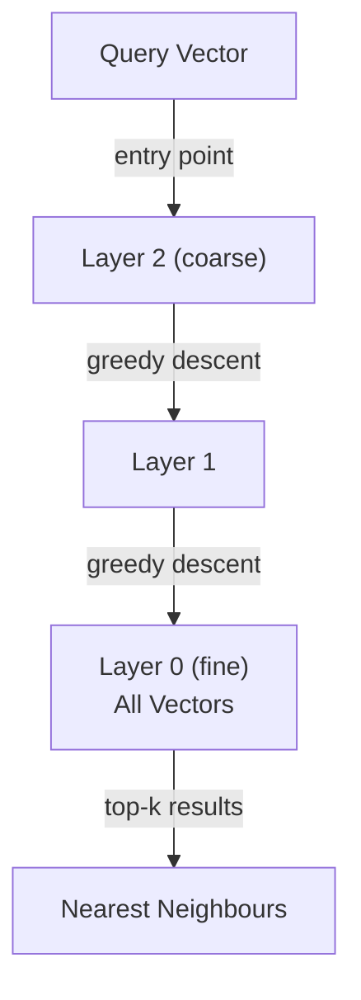

---

## Future Roadmap

### Phase 1 – Optimization & Performance

#### 1.1 Answer Synthesis (RAG Completion)

**Current gap:** The app returns raw document chunks to the user. A true RAG system passes those chunks to the LLM to synthesise a coherent, cited answer.

**Implementation sketch:**

```python
# After retrieving chunks from Azure AI Search...
context = "\n\n".join([f"[{r['source']}]: {r['content']}" for r in results])

response = openai_client.chat.completions.create(
    model=chat_deployment,
    messages=[
        {"role": "system", "content": (
            "You are a helpful assistant. Answer the question using ONLY the context below. "
            "Cite the source filename in square brackets after each fact.\n\n"
            f"Context:\n{context}"
        )},
        {"role": "user", "content": user_query}
    ],
    temperature=0.2
)
answer = response.choices[0].message.content
```

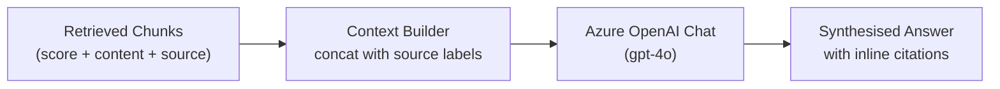

---

#### 1.2 Hybrid Search

**Current gap:** Pure vector search misses exact matches for product codes, IDs, and acronyms (e.g., "SKU-7812", "BonusId=42") because these have no semantic meaning.

**Solution:** Azure AI Search natively supports combining BM25 keyword search with vector search using Reciprocal Rank Fusion (RRF).

```python
from azure.search.documents.models import VectorizedQuery

results = search_client.search(
    search_text=user_query,          # BM25 keyword search
    vector_queries=[VectorizedQuery(
        vector=query_vector,
        k_nearest_neighbors=10,
        fields="embedding"
    )],
    query_type="semantic",           # Enable semantic re-ranking on top of hybrid
    semantic_configuration_name="my-semantic-config",
    select=["id", "content", "source_file"],
    top=5
)
```

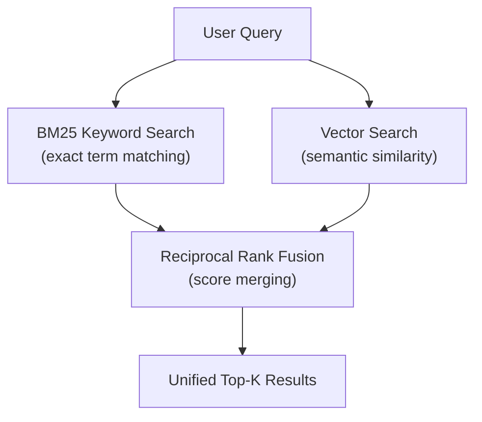

---

#### 1.3 Reranking

After hybrid search returns a broad candidate set (top-20), a reranker model scores each chunk by its relevance to the specific query, collapsing the list to a high-precision top-5 before the LLM sees it.

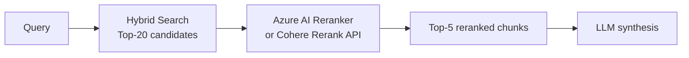

```python
# Using Azure AI Search built-in semantic reranker
results = search_client.search(
    search_text=user_query,
    vector_queries=[vector_query],
    query_type="semantic",
    semantic_configuration_name="my-semantic-config",
    query_caption="extractive",
    query_answer="extractive",
    top=5
)
for r in results:
    print(r["@search.reranker_score"], r["content"])
```

---

#### 1.4 Semantic / Hierarchical Chunking

**Current gap:** `RecursiveCharacterTextSplitter` splits purely by character count. A page heading that belongs to the next paragraph can end up in a different chunk, severing the logical connection.

**Solution:** Use semantic chunking — split when the embedding similarity between consecutive sentences drops below a threshold — or use a markdown/header-aware splitter.

```python
# Option A: LangChain SemanticChunker (requires embeddings at split time)
from langchain_experimental.text_splitter import SemanticChunker
from langchain_openai import AzureOpenAIEmbeddings

embeddings = AzureOpenAIEmbeddings(
    azure_deployment=embedding_deployment,
    azure_endpoint=openai_endpoint,
    api_key=openai_key
)
splitter = SemanticChunker(embeddings, breakpoint_threshold_type="percentile")
chunks = splitter.split_text(document_text)

# Option B: Header-aware splitter for structured documents
from langchain.text_splitter import MarkdownHeaderTextSplitter
headers_to_split_on = [("#", "H1"), ("##", "H2"), ("###", "H3")]
splitter = MarkdownHeaderTextSplitter(headers_to_split_on=headers_to_split_on)
chunks = splitter.split_text(markdown_text)
```

---

### Phase 2 – Scalability & DevOps

#### 2.1 Asynchronous Event-Driven Ingestion

**Current gap:** `ingest.py` and `search_indexer.py` are manually run scripts. Any new PDF uploaded to Blob Storage requires a human to re-run the pipeline.

**Solution:** Replace the scripts with an Azure Function triggered by a Blob Storage event. The function fires automatically the moment a new PDF lands in the container.

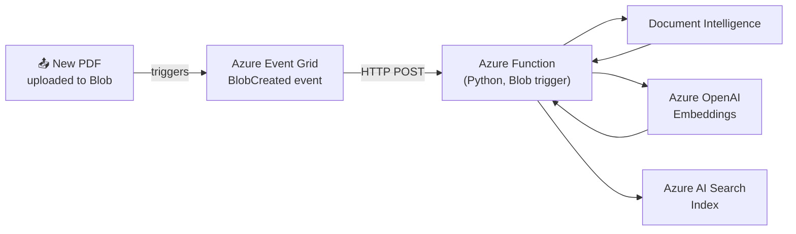

**Azure Function stub (`function_app.py`):**

```python
import azure.functions as func
import logging

app = func.FunctionApp()

@app.blob_trigger(
    arg_name="myblob",
    path="documents/{name}",
    connection="AZ_STORAGE_STRING"
)
def ingest_document(myblob: func.InputStream):
    logging.info(f"New blob detected: {myblob.name} ({myblob.length} bytes)")
    pdf_bytes = myblob.read()
    # Run Document Intelligence → chunking → embedding → indexing
    process_and_index(pdf_bytes, source_name=myblob.name)
```

---

#### 2.2 Monitoring and RAG Evaluation with RAGAS

Gut-feel evaluation is not enough for production. RAGAS provides automated metrics that quantify retrieval and generation quality.

| RAGAS Metric | What it measures |
|---|---|
| `faithfulness` | Is the answer supported by the retrieved context? (anti-hallucination) |
| `answer_relevancy` | Is the answer on-topic? |
| `context_precision` | Are the retrieved chunks actually useful? |
| `context_recall` | Did retrieval miss any necessary information? |

```python
from ragas import evaluate
from ragas.metrics import faithfulness, answer_relevancy, context_precision
from datasets import Dataset

# Build an evaluation dataset from logged queries
data = {
    "question":  ["What is the refund policy?"],
    "answer":    [generated_answer],
    "contexts":  [[chunk["content"] for chunk in retrieved_chunks]],
    "ground_truth": ["Our refund policy allows returns within 30 days."]
}
dataset = Dataset.from_dict(data)

results = evaluate(dataset, metrics=[faithfulness, answer_relevancy, context_precision])
print(results)  # DataFrame with per-metric scores
```

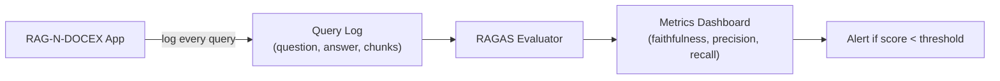

---

#### 2.3 Containerization with Docker

Packaging the application in Docker eliminates "works on my machine" problems and is a prerequisite for cloud deployment to Azure Container Apps or AKS.

**`Dockerfile`:**

```dockerfile
FROM python:3.12-slim

WORKDIR /app

COPY requirements.txt .
RUN pip install --no-cache-dir -r requirements.txt

COPY . .

EXPOSE 8501

HEALTHCHECK CMD curl --fail http://localhost:8501/_stcore/health || exit 1

ENTRYPOINT ["streamlit", "run", "streamlit_app.py", \
            "--server.port=8501", "--server.address=0.0.0.0"]
```

**`docker-compose.yml`** (for local development with env injection):

```yaml
version: "3.9"
services:
  ragndocex:
    build: .
    ports:
      - "8501:8501"
    env_file:
      - .env
    volumes:
      - ./processed_data:/app/processed_data
```

---

### Phase 3 – Advanced UX & Features

#### 3.1 Multi-Agent SQL Verification with LangGraph

**Current gap:** The generated SQL is sent directly to the UI without any validation. It may contain syntax errors or hallucinated column names.

**Solution:** Use a LangGraph "verify-then-execute" graph where a Critic agent checks the generated SQL against the schema before it is shown to the user.

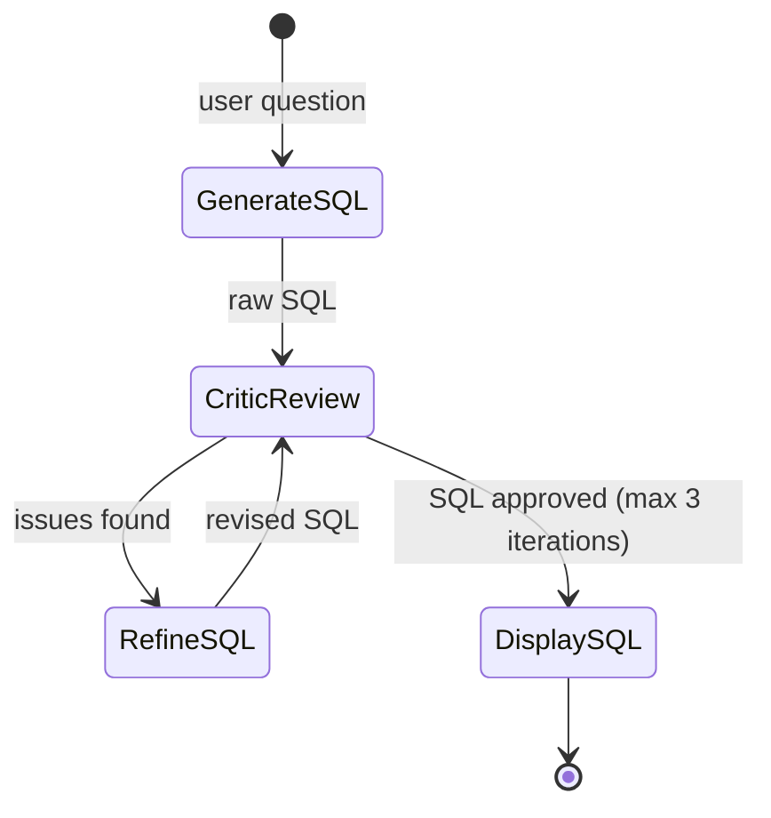

```python
from langgraph.graph import StateGraph, END
from typing import TypedDict

class SQLState(TypedDict):
    question: str
    sql: str
    feedback: str
    iterations: int

def generate_node(state: SQLState) -> SQLState:
    state["sql"] = generate_sql_query(state["question"])
    return state

def critic_node(state: SQLState) -> SQLState:
    # Ask a second LLM call to validate the SQL against the schema
    prompt = f"Schema:\n{DATABASE_SCHEMA}\n\nSQL:\n{state['sql']}\n\nIs this SQL valid? List any errors."
    feedback = llm.invoke(prompt)
    state["feedback"] = feedback
    state["iterations"] += 1
    return state

def router(state: SQLState) -> str:
    if "no errors" in state["feedback"].lower() or state["iterations"] >= 3:
        return "display"
    return "refine"

graph = StateGraph(SQLState)
graph.add_node("generate", generate_node)
graph.add_node("critic",   critic_node)
graph.add_conditional_edges("critic", router, {"display": END, "refine": "generate"})
graph.set_entry_point("generate")
graph.add_edge("generate", "critic")
app = graph.compile()
```

---

#### 3.2 User Feedback Loop

Capturing explicit user feedback closes the quality loop and provides training signal for future prompt tuning or fine-tuning.

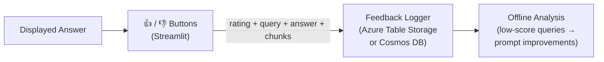

**Streamlit feedback widget:**

```python
col1, col2 = st.columns(2)
with col1:
    if st.button("👍 Helpful"):
        log_feedback(query=prompt, answer=answer, chunks=results, rating=1)
        st.success("Thanks for the feedback!")
with col2:
    if st.button("👎 Not Helpful"):
        log_feedback(query=prompt, answer=answer, chunks=results, rating=0)
        st.warning("We'll use this to improve.")
```

---

#### 3.3 Source Citation UI with Page Highlights

**Current gap:** The source expander shows raw text. Users cannot see where in the PDF the answer came from.

**Solution:** Store the page number alongside each chunk at index time (Document Intelligence provides `page_number` per paragraph), then render a page thumbnail in the UI using `pdf2image`.

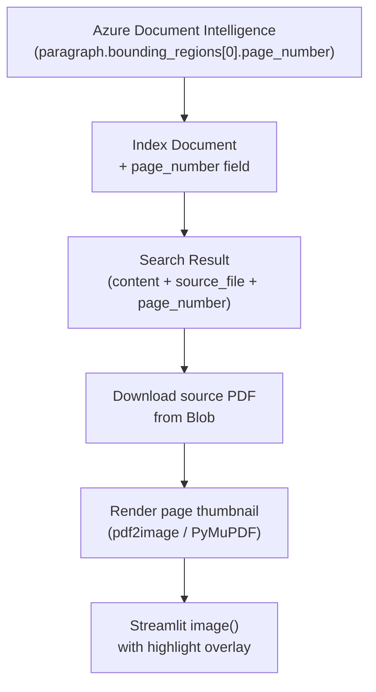

**Extended index document with page number:**

```python
# In search_indexer.py — extend the document dict
doc = {
    "id":          safe_id,
    "content":     chunk,
    "source_file": filename,
    "page_number": paragraph.bounding_regions[0].page_number,  # new field
    "embedding":   embedding
}
```

**Rendering the thumbnail in Streamlit:**

```python
import fitz  # PyMuPDF

def render_page_thumbnail(pdf_bytes: bytes, page_number: int) -> bytes:
    doc = fitz.open(stream=pdf_bytes, filetype="pdf")
    page = doc[page_number - 1]          # 0-indexed
    pix = page.get_pixmap(dpi=150)
    return pix.tobytes("png")

# In the search results expander:
with st.expander(f"📄 {result['source']} — page {result['page_number']}"):
    pdf_bytes = download_blob(result["source_file"])
    img = render_page_thumbnail(pdf_bytes, result["page_number"])
    st.image(img, caption=f"Page {result['page_number']}", use_column_width=True)
    st.markdown(result["content"])
```

---

*This document will be updated as each phase is implemented.*
