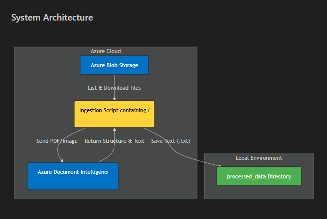

# Data Ingestion, Vectorization & Search Layer

This project implements a complete RAG (Retrieval-Augmented Generation) pipeline backend. It ingests documents (PDFs) from Azure Blob Storage, extracts text, vectorizes the content using Azure OpenAI, and indexes it into Azure AI Search for retrieval.

## Features

*   **Azure Blob Integration**: Connects to a specified container to fetch documents.
*   **Document Intelligence**: Extracts text from PDFs using the `prebuilt-layout` model.
*   **Vectorization**: Chunking and embedding text using `langchain` and Azure OpenAI (`text-embedding-ada-002`).
*   **AI Search Indexing**: Automatically creates and manages a vector index in Azure AI Search.
*   **Vector Search**: Includes a tool to verify and test vector-based retrieval.



## Prerequisites

*   Python 3.12+
*   Azure Storage Account (Blob)
*   Azure Document Intelligence Resource
*   Azure OpenAI Service (with an embedding model deployed)
*   Azure AI Search Service

## Setup

1.  **Clone the repository** (if applicable) or navigate to the project directory.

2.  **Install Dependencies**:
    ```bash
    pip install -r requirements.txt
    ```

3.  **Environment Configuration**:
    Create a `.env` file in the root directory (copy `.env.example`).
    ```bash
    cp .env.example .env
    ```
    Fill in your Azure credentials:
    *   **Data Ingestion**: `AZURE_DI_KEY`, `AZURE_DI_ENDPOINT`, `AZ_STORAGE_STRING`, `AZ_STORAGE_CONTAINER`.
    *   **Vectorization (OpenAI)**: `AZURE_OPENAI_ENDPOINT`, `AZURE_OPENAI_API_KEY`, `AZURE_OPENAI_EMBEDDING_DEPLOYMENT` (Model Name).
    *   **Search**: `AZURE_SEARCH_ENDPOINT`, `AZURE_SEARCH_API_KEY`, `AZURE_SEARCH_INDEX_NAME`.

## Usage

### 1. Ingest Data
Extract text from your Azure Blobs into local `.txt` files.
```bash
python ingest.py
```
*Output: Extracted text files in `processed_data/`.*

### 2. Vectorize & Index
Chunk the extracted text, generate embeddings, and upload them to Azure AI Search.
```bash
python search_indexer.py
```
*Output: Documents indexed in Azure AI Search.*

### 3. Test Search
Run a vector search query to verify the pipeline.
```bash
python search_query.py
```
*Input: Type your query (e.g., "cruise incentive").*
*Output: Top 3 matching document chunks with similarity scores.*
