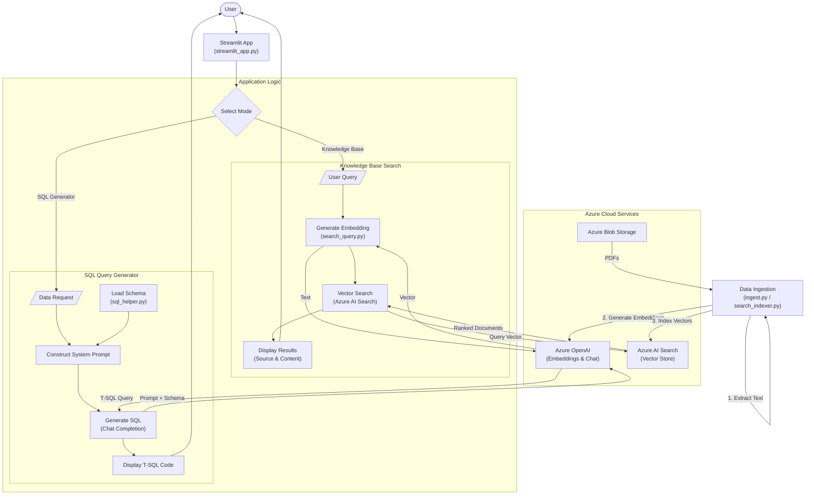
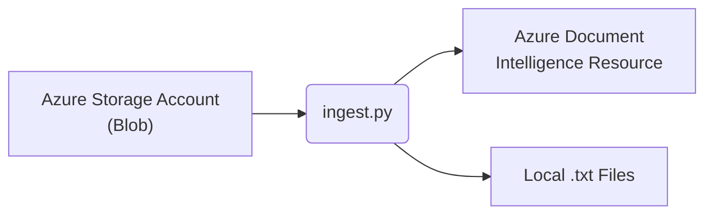
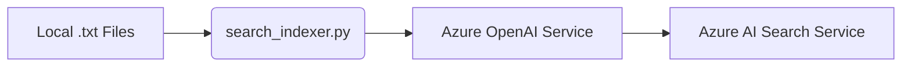
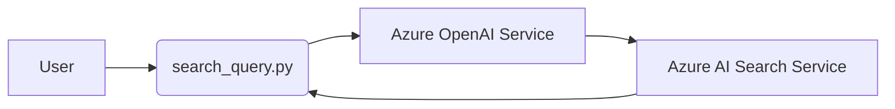
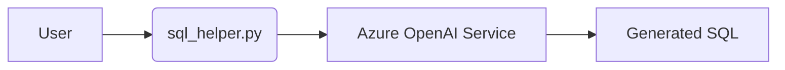
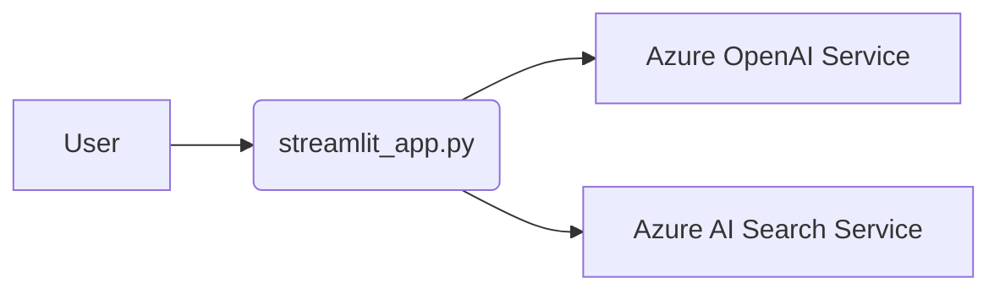

# Data Ingestion, Vectorization & Search Layer

This project implements a complete RAG (Retrieval-Augmented Generation) pipeline backend. It ingests documents (PDFs) from Azure Blob Storage, extracts text, vectorizes the content using Azure OpenAI, and indexes it into Azure AI Search for retrieval.

## Features

*   **Azure Blob Integration**: Connects to a specified container to fetch documents.
*   **Document Intelligence**: Extracts text from PDFs using the `prebuilt-layout` model.
*   **Vectorization**: Chunking and embedding text using `langchain` and Azure OpenAI (`text-embedding-ada-002`).
*   **AI Search Indexing**: Automatically creates and manages a vector index in Azure AI Search.
*   **Vector Search**: Includes a tool to verify and test vector-based retrieval.


```mermaid
flowchart TD
    %% Nodes
    User([User])
    Streamlit["Streamlit App<br/>(streamlit_app.py)"]
    Ingestion["Data Ingestion<br/>(ingest.py / search_indexer.py)"]
    
    subgraph Azure_Services [Azure Cloud Services]
        Blob[Azure Blob Storage]
        AOAI["Azure OpenAI<br/>(Embeddings & Chat)"]
        AIS["Azure AI Search<br/>(Vector Store)"]
    end

    subgraph App_Logic [Application Logic]
        Router{Select Mode}
        
        subgraph Mode_Search [Knowledge Base Search]
            Input1[/User Query/]
            Embed["Generate Embedding<br/>(search_query.py)"]
            Search["Vector Search<br/>(Azure AI Search)"]
            Display1["Display Results<br/>(Source & Content)"]
        end
        
        subgraph Mode_SQL [SQL Query Generator]
            Input2[/Data Request/]
            Schema["Load Schema<br/>(sql_helper.py)"]
            Prompt[Construct System Prompt]
            GenSQL["Generate SQL<br/>(Chat Completion)"]
            Display2[Display T-SQL Code]
        end
    end

    %% Edges - Ingestion
    Blob -- PDFs --> Ingestion
    Ingestion -- 1. Extract Text --> Ingestion
    Ingestion -- 2. Generate Embeddings --> AOAI
    Ingestion -- 3. Index Vectors --> AIS

    %% Edges - User Flow
    User --> Streamlit
    Streamlit --> Router

    %% Search Flow
    Router -- Knowledge Base --> Input1
    Input1 --> Embed
    Embed -- Text --> AOAI
    AOAI -- Vector --> Embed
    Embed --> Search
    Search -- Query Vector --> AIS
    AIS -- Ranked Documents --> Search
    Search --> Display1
    Display1 --> User

    %% SQL Flow
    Router -- SQL Generator --> Input2
    Input2 --> Prompt
    Schema --> Prompt
    Prompt --> GenSQL
    GenSQL -- Prompt + Schema --> AOAI
    AOAI -- T-SQL Query --> GenSQL
    GenSQL --> Display2
    Display2 --> User
```

## Prerequisites

*   Python 3.12+
*   Azure Storage Account (Blob)
*   Azure Document Intelligence Resource
*   Azure OpenAI Service (with an embedding model deployed)
*   Azure AI Search Service

## Setup

1.  **Clone the repository** (if applicable) or navigate to the project directory.

2.  **Install Dependencies**:
    ```bash
    pip install -r requirements.txt
    ```

3.  **Environment Configuration**:
    Create a `.env` file in the root directory (copy `.env.example`).
    ```bash
    cp .env.example .env
    ```
    Fill in your Azure credentials:
    *   **Data Ingestion**: `AZURE_DI_KEY`, `AZURE_DI_ENDPOINT`, `AZ_STORAGE_STRING`, `AZ_STORAGE_CONTAINER`.
    *   **Vectorization (OpenAI)**: `AZURE_OPENAI_ENDPOINT`, `AZURE_OPENAI_API_KEY`, `AZURE_OPENAI_EMBEDDING_DEPLOYMENT` (Model Name).
    *   **Search**: `AZURE_SEARCH_ENDPOINT`, `AZURE_SEARCH_API_KEY`, `AZURE_SEARCH_INDEX_NAME`.

## Usage

This project consists of several modular scripts that can be run individually.

### 1. Data Ingestion
**Script**: `ingest.py`  
Connects to Azure Blob Storage, downloads PDFs, and uses Azure Document Intelligence to extract text.

```mermaid
graph LR
    Blob["Azure Storage Account<br/>(Blob)"] --> Script("ingest.py")
    Script --> DI["Azure Document<br/>Intelligence Resource"]
    Script --> Files["Local .txt Files"]
```
```bash
python ingest.py
```
*   **Output**: Extracted text files are saved in the `processed_data/` directory.

### 2. Vectorization & Indexing
**Script**: `search_indexer.py`  
Reads the extracted text files, splits them into chunks, generates embeddings using Azure OpenAI, and indexes them in Azure AI Search.

```mermaid
graph LR
    Files["Local .txt Files"] --> Script("search_indexer.py")
    Script --> AOAI["Azure OpenAI Service"]
    AOAI --> Search["Azure AI Search Service"]
```
```bash
python search_indexer.py
```
*   **Note**: This script will DELETE and recreate the target index (`AZURE_SEARCH_INDEX_NAME`) to ensure schema consistency.

### 3. CLI Retrieval Test
**Script**: `search_query.py`  
A standalone CLI tool to verify that your data was indexed correctly and to test vector search retrieval.

```mermaid
graph LR
    User --> Script("search_query.py")
    Script --> AOAI["Azure OpenAI Service"]
    AOAI --> Search["Azure AI Search Service"]
    Search --> Script
```
```bash
python search_query.py
```
*   **Interactive**: Prompts for a search query and returns the top matching document chunks with their similarity scores.

### 4. CLI SQL Generation Test
**Script**: `sql_helper.py`  
A standalone CLI tool to test the Text-to-SQL logic using the defined schema.

```mermaid
graph LR
    User --> Script("sql_helper.py")
    Script --> AOAI["Azure OpenAI Service"]
    AOAI --> SQL["Generated SQL"]
```
```bash
python sql_helper.py
```
*   **Interactive**: Prompts for a natural language question (e.g., "Who are the top earners?") and outputs the generated T-SQL query.

### 5. Main Streamlit Application
**Script**: `streamlit_app.py`  
The primary user interface that combines both the Knowledge Base (RAG) and SQL Generation features.

```mermaid
graph LR
    User --> App("streamlit_app.py")
    App --> AOAI["Azure OpenAI Service"]
    App --> Search["Azure AI Search Service"]
```
```bash
streamlit run streamlit_app.py
```
*   **Knowledge Base Tab**: Chat with your documents using vector search + extraction.
*   **SQL Generator Tab**: Generate SQL queries from natural language for your database.
